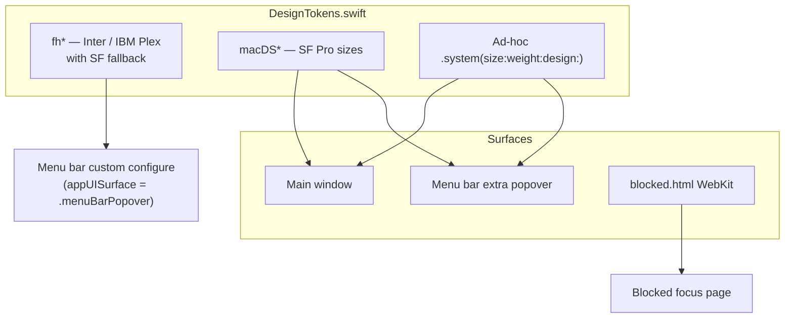

# FocusHacker Typography Audit

**Date:** 2026-05-26  
**Scope:** macOS app (`FocusHacker/`), design references, WebKit blocked page, React prototype  
**Method:** Static analysis of `DesignTokens.swift` and all `.font()` / `NSFont` call sites; runtime spot-check via `NSFont(name:size:)` on build host.

---

## Executive summary

| Family (design intent) | In product spec | Defined in Swift | Bundled in app | Used in live UI today |
|------------------------|-----------------|------------------|--------------|------------------------|
| **Inter** | Yes (UI / body) | `fh*` tokens via `FocusHackerFontFamily` | **No** | Intended in `fh*` only; **renders as SF Pro** (fallback) |
| **IBM Plex Mono** | Yes (timer, XP, digits) | `fhTimer`, `fhXp`, `fhXpBadge` | **No** | **Not referenced in any view**; timers use `macDSTimerDigits` → **SF Mono** |
| **Lora** | Yes (marketing / display) | Web HTML only | N/A | **Not in Swift** |
| **SF Pro / system** | Implicit (macOS) | All `macDS*` + most ad-hoc `.system()` | Yes (OS) | **Dominant** across the entire app |

**Bottom line:** The shipped app is effectively a **system-font (SF Pro + SF Mono)** product. Inter and IBM Plex Mono exist as optional code paths in [`FocusHacker/Resources/DesignTokens.swift`](FocusHacker/Resources/DesignTokens.swift) but are not bundled, so `customIfAvailable` always falls back. The newer **MacDS** scale (`macDSPageTitle`, `macDSBody`, etc.) is what most surfaces use.

**Runtime verification (this machine):**

```
Inter-Regular: missing
Inter-SemiBold: missing
IBMPlexMono-Bold: missing
System: .AppleSystemUIFont
Mono system: .AppleSystemUIFontMonospaced-Bold
```

Re-run after bundling fonts: `NSFont(name: "Inter-Regular", size: 15) != nil` should be true.

---

## Typography architecture

Three layers coexist in code:



### `AppUISurface` and `fh*` usage

`AppUISurface` switches form chrome and some timer field fonts:

| `appUISurface` | Set by | Effect on fonts |
|----------------|--------|-----------------|
| `.mainWindow` | Main window, menu bar popover root, settings, profile, etc. | `macDS*` for timer configuration labels/digits |
| `.menuBarPopover` | `TimerSessionConfigurationForm` when `profile == .menuBarPopoverCustom` | `fhCaption` / `fhBody` for configure fields (still SF at runtime) |

Menu bar popover sets `.environment(\.appUISurface, .mainWindow)` at the root ([`MenuBarPopoverView.swift`](FocusHacker/Views/AppShell/MenuBarPopoverView.swift)), but [`FocusSessionScreenView`](FocusHacker/Views/AppShell/FocusSessionScreenView.swift) embeds `TimerSessionConfigurationForm(profile: .menuBarPopoverCustom)` when `layout == .menuBarPopover`, which re-injects `.menuBarPopover` for children.

---

## Token reference

### `FocusHackerFontFamily` (custom faces)

| PostScript name | Intended use |
|-----------------|--------------|
| `Inter-Regular` | Body, caption |
| `Inter-Medium` | (defined, unused in tokens) |
| `Inter-SemiBold` | Display, title, heading |
| `IBMPlexMono-Bold` | Timer, XP, badge counts |

No `.ttf` / `.otf` files in repo; no `UIAppFonts` / font entries in `FocusHacker.xcodeproj`.

### `fh*` tokens

| Token | Custom (if bundled) | Fallback (current) | View call sites |
|-------|---------------------|--------------------|-----------------|
| `fhDisplay` | Inter SemiBold 48 | SF 48 bold | [`RootView.swift`](FocusHacker/Views/RootView.swift) preview only — **not in app shell** |
| `fhTitle` | Inter SemiBold 28 | SF 28 semibold | **None** |
| `fhHeading` | Inter SemiBold 18 | SF 18 semibold | **None** |
| `fhBody` | Inter Regular 15 | SF 15 regular | Menu bar configure digits when `appUISurface == .menuBarPopover` |
| `fhCaption` | Inter Regular 12 | SF 12 regular | Menu bar configure labels when `appUISurface == .menuBarPopover` |
| `fhTimer(size:)` | IBM Plex Mono Bold | SF bold monospaced | **None** |
| `fhXp` | IBM Plex Mono Bold 22 | SF 22 semibold mono | **None** |
| `fhXpBadge` | IBM Plex Mono Bold 12 | SF 12 bold mono | **None** |

### `macDS*` tokens (always SF Pro at listed sizes)

| Token | Size | Weight | Design | Typical use |
|-------|------|--------|--------|-------------|
| `macDSPageTitle` | 28 | bold | default | Analytics title, paywall headline |
| `macDSSectionHeading` | 18 | bold | default | Section headers, onboarding steps |
| `macDSCardTitle` | 16 | semibold | default | Card titles, sidebar app name |
| `macDSBody` | 14 | regular | default | Body, buttons, table cells |
| `macDSLabel` | 12 | medium | default | Labels, sidebar theme toggle |
| `macDSHelper` | 12 | regular | default | Helper / instructional copy |
| `macDSCaption` | 11 | regular | default | Captions, metadata |
| `macDSTimerDigits(size:)` | dynamic | bold | **monospaced** | Hero countdown in `TimerThreeRowSlabView` (legacy view) |

Modifiers used in views: `.monospacedDigit()`, `.monospaced()`, `.weight(...)`.

### SwiftUI semantic styles (macOS defaults ≈ SF Pro)

| Style | Approx. size | Used in |
|-------|--------------|---------|
| `.caption` | ~12pt | Profile progress tabs, analytics month controls, sidebar theme toggle |
| `.caption2` | ~11pt | Profile focus chart axes, tooltips |

### Component / button styles in `DesignTokens.swift`

| Component | Font |
|-----------|------|
| `TimerBrutalistPrimarySlabButtonStyle` | SF 16 **heavy**, uppercase |
| `TimerBrutalistOutlineButtonStyle` | SF 14 semibold, uppercase |
| `TimerBrutalistGhostButtonStyle` | SF 13 semibold, uppercase |
| `MacDSPrimaryButtonStyle` | `macDSBody` medium |
| `MacDSSecondaryButtonStyle` | `macDSBody` medium |
| `MacDSDestructiveOutlineButtonStyle` | `macDSBody` medium |
| `MacDSGhostButtonStyle` | `macDSLabel` |
| `MacDSPillTag` | SF 13 medium |
| `MacDSCircularProgressRing` center | SF 30 bold **rounded** |
| `MacDSPopoverRow` checkmark | SF 12 semibold |
| `MacDSMenuPicker` chevron | SF 11 semibold |
| `MacDSActionMenuTriggerButton` | SF 16 semibold |
| `MacDSIconButton` | SF 15 medium |
| `MacDSEndSessionConfirmationPanel` icon | SF 28 medium |
| `MacDSSlabCompactPrimaryButtonStyle` | SF semibold (default 11pt) |
| `MacDSSlabCompactSecondaryButtonStyle` | SF semibold (default 11pt) |
| `MacDSSidebarNavItem` | `macDSBody` medium/regular |
| `MacDSTabBar` | `macDSBody` medium/regular |
| `MacDSTextField` | `macDSBody` |
| `macDSHelperText()` modifier | `macDSHelper` |

### AppKit (non-SwiftUI)

| File | Fonts |
|------|-------|
| [`AppBundleIdentifierPicker.swift`](FocusHacker/Services/Blocker/AppBundleIdentifierPicker.swift) | `NSFont.systemFont` 12 semibold (title), 11 regular (status) |

### WebKit blocked page

| File | Stack |
|------|-------|
| [`FocusHacker/Resources/blocked.html`](FocusHacker/Resources/blocked.html) | `-apple-system`, `BlinkMacSystemFont`, `'Inter'`, `system-ui` — Inter only if installed on the system |
| `h1` | ~28–40px (clamp), weight 700 |
| `p` | ~16.8px (1.05rem) |

### React prototype (not in macOS target)

[`src/components/WeekProgress/weekProgress.module.css`](src/components/WeekProgress/weekProgress.module.css): Google Fonts **Inter** + **IBM Plex Mono** (CDN).

---

## Section-by-section matrix

### Main window shell

| Area | Files | Primary fonts | Notes |
|------|-------|---------------|-------|
| **Sidebar** | `MainWindowRootView`, `MacDSSidebarNavItem`, `SidebarColorThemeToggle` | `macDSCardTitle`, `macDSBody`, `macDSLabel`, `.caption` | Coherent MacDS |
| **End session overlay** | `MacDSEndSessionConfirmationPanel` | `macDSCardTitle`, `macDSHelper`, button styles | MacDS |
| **Completion / level-up banners** | `MainWindowRootView`, `FocusBadgeLevelUpBanner` | `macDSBody` semibold, `macDSCaption` | MacDS |

### Timer (`AppShellSection.timer`)

| Sub-area | Files | Fonts | Resolved family |
|----------|-------|-------|-----------------|
| **Focus session card** | `FocusSessionScreenView` | All ad-hoc `.system` from `FocusSessionScreenLayout` | SF Pro / SF Mono |
| Hero countdown | `FocusSessionTimerDigits` | `fontSize`: 72 main / 68 popover, bold **monospaced** | SF Mono |
| Preset carousel | `FocusSessionPresetPicker` | Mix `macDSLabel`, `macDSCaption`, `macDSHelper`, ad-hoc 8–13pt | Mostly MacDS |
| **Configure session (main)** | `TimerSessionConfigurationForm` profile `.mainWindow` | `macDSCardTitle` headers, `macDSLabel`/`macDSCaption` fields, `macDSBody.monospacedDigit()` | MacDS |
| **3-row slab (legacy)** | `TimerThreeRowSlabView` | `macDSTimerDigits` hero; footer `.system` + `.monospacedDigit()` | SF Mono hero — **view not mounted in current UI** (compiled only) |

#### `FocusSessionScreenLayout` font sizes

| Role | Main window | Menu bar popover |
|------|-------------|------------------|
| Screen label | 12 medium | 12 medium |
| Preset name | 17 medium | 17 medium |
| Preset subtitle | 12 regular | 12 regular |
| Timer digits | 72 bold mono | 68 bold mono |
| Up next | 11 medium | 11 medium |
| Cycle pill label / value | 11 medium / 13 semibold mono | same |
| CTA | 16 semibold | 16 semibold |
| Stats label / value | 10 medium / 12 medium mono | same |
| Gear icon | 20 regular | 20 regular |
| Secondary control | 13 medium | 13 medium |

### Menu bar extra

| Area | Files | Fonts |
|------|-------|-------|
| **Status item** | `MenuBarStatusLabel` | SF 12 semibold **monospaced** (countdown / GET READY) |
| **Popover chrome** | `MenuBarPopoverView` | `macDSHelper`, `macDSBody`; actions SF 13 medium |
| **Session UI** | `FocusSessionScreenView` (popover layout) | Same ad-hoc system scale as above (smaller timer) |
| **Custom configure** | `TimerSessionConfigurationForm` `.menuBarPopoverCustom` | `fhCaption` / `fhBody` for fields → **SF** at runtime; section headers `macDSLabel` semibold |

### Profile / History (`AppShellSection.history`)

| Sub-area | Files | Dominant approach |
|----------|-------|-------------------|
| Page chrome | `ProfileDashboardView`, `MacDSSectionHeader` | MacDS |
| **Hero card** | `ProfileHeroCard`, `ProfileHeroComponents` | **Ad-hoc** 10–20pt system (not MacDS) |
| **Week progress** | `ProfileWeeklyProgressCard`, `ProfileWeeklyProgressComponents` | Card title MacDS; streak **80pt bold monospaced**; goals 12–13pt |
| **Focus chart** | `ProfileFocusChartView` | `macDSBody`; axes `.caption` / `.caption2` |
| **Progress tabs** | `ProfileProgressSection` | `macDSCardTitle` bold; tab labels `.caption` semibold |
| **Badge / level-up** | `FocusBadgeHeroBackground` | `macDSBody`, `macDSCaption`; emblem SF symbol size |

### Analytics (`AppShellSection.analytics`)

| Sub-area | Files | Fonts |
|----------|-------|-------|
| Title | `AnalyticsDetailView` | `macDSPageTitle` |
| Stat cards | `AnalyticsSummaryStatCardsView` | `macDSLabel`; value SF **28 bold rounded**; `macDSCaption` |
| Controls | `AnalyticsControlsRowView` | `macDSLabel`; chevrons `.caption` semibold |
| Session table | `AnalyticsSessionLogTableView` | `macDSBody` / `.monospaced()`; status badge 10pt bold + `macDSCaption` |

### Settings (`AppShellSection.settings`)

| Sub-area | Files | Fonts |
|----------|-------|-------|
| Most copy | `AppSettingsDetailView` | Full MacDS scale |
| Duration stepper | `SettingsFocusTargetValueDisplay` | SF **22 semibold** + `macDSHelper` |
| Voice packs | `VoicePackSelectorView`, `VoicePackRow` | `macDSHelper`; play icon SF 11 semibold |
| Weekly target | `PersonalWeeklyTargetInput` | `macDSLabel`, `macDSBody.monospacedDigit()`, `macDSCaption` |
| Selection rows | `SettingsSelectionRow` | SF 14 medium icon; `macDSLabel` / `macDSCaption` |

### Blocked items (`AppShellSection.blockedItems`)

| Files | Fonts |
|-------|-------|
| `BlockedItemsDetailView` | `macDSCaption`, `macDSBody`, `macDSBody.monospaced()` for domains |

### Onboarding (first launch window)

| Files | Fonts |
|-------|-------|
| `FirstLaunchOnboardingFlowView` | `macDSSectionHeading` (steps), `macDSCaption` (helper) |

### Paywall

| Files | Fonts |
|-------|-------|
| `PaywallView` | `macDSPageTitle`, `macDSBody`, `macDSLabel` |

### Dead / scaffold code

| Item | Notes |
|------|-------|
| [`RootView.swift`](FocusHacker/Views/RootView.swift) | Only `#Preview`; uses `fhDisplay` / `fhBody` — not in production navigation |
| [`TimerThreeRowSlabView`](FocusHacker/Views/AppShell/TimerThreeRowSlabView.swift) | No references from other views; superseded by `FocusSessionScreenView` for timer UI |

---

## Design spec comparison

### [`FH_Web_Design System.html`](FH_Web_Design%20System.html)

| Token | Family | Product app |
|-------|--------|-------------|
| `--font-display` | **Lora** | Not used in Swift |
| `--font-ui` | **Inter** | Intended via `fh*`; actual UI uses **MacDS / SF** |
| `--font-mono` | **IBM Plex Mono** | Intended via `fhTimer`/`fhXp`; actual digits use **SF Mono** |
| Scale examples | Hero 54–96px Lora; body 17px Inter; mono labels 13px | Closest: Focus timer 72/68 SF Mono; MacDS body **14px** |

### [`DESIGN_SYSTEM_REVIEW.md`](DESIGN_SYSTEM_REVIEW.md)

- Documents **Inter** + **IBM Plex Mono** for the app; no serif in product UI (aligns with Lora being web-only).
- Implementation lags: MacDS system scale replaced most Inter usage without bundling Inter.

### [`IMPLEMENTATION_PROMPT.md`](IMPLEMENTATION_PROMPT.md)

- States “Inter (body), IBM Plex Mono (numbers)” — matches intent, not current rendering.

---

## Inconsistencies (ranked by visibility)

1. **Spec vs runtime:** Design calls for Inter + IBM Plex; users see **SF Pro + SF Mono** everywhere.
2. **Dual token systems:** `macDS*` (14px body) vs `fh*` (15px body) vs ad-hoc sizes — no single source of truth.
3. **Focus session screen bypasses tokens:** Largest UI element (timer) uses raw `.system` in [`FocusSessionScreenView`](FocusHacker/Views/AppShell/FocusSessionScreenView.swift), not `macDSTimerDigits` or `fhTimer`.
4. **Profile week streak:** 80pt monospaced system font — visually dominant, unrelated to `fhXp` or MacDS.
5. **Analytics stat values:** 28pt **rounded** system — unique design variant; nowhere else in app.
6. **Unused `fh*` tokens:** `fhTitle`, `fhHeading`, `fhTimer`, `fhXp`, `fhXpBadge` are dead code.
7. **`fh*` effectively dead in main window:** All production surfaces set `appUISurface` to `.mainWindow` except menu bar custom configure subtree.
8. **Menu bar popover forces MacDS at root** but timer card still uses ad-hoc system fonts (not `fh*`).
9. **Legacy `TimerThreeRowSlabView`:** Still compiled; uses `macDSTimerDigits` — confusing if someone re-wires it later.
10. **blocked.html:** Declares Inter in CSS but will render SF on machines without Inter installed.

---

## File inventory (`.font(` call counts)

29 Swift files contain `.font(` (28 views + `DesignTokens.swift`). Highest ad-hoc usage: `FocusSessionScreenView` (16), `AppSettingsDetailView` (33, mostly MacDS tokens), `TimerThreeRowSlabView` (15, unused UI).

---

## Recommendations (follow-up, not implemented)

1. **Bundle fonts:** Add Inter (Regular, Medium, SemiBold) and IBM Plex Mono Bold to the target; register in Info.plist / Xcode target membership.
2. **Pick one system:** Either extend MacDS to wrap custom faces, or migrate MacDS call sites to `fh*` — avoid both.
3. **Unify timer digits:** Point `FocusSessionScreenView` hero and `macDSTimerDigits` at one helper (ideally IBM Plex when bundled).
4. **Profile tokens:** Replace Profile hero / week-progress ad-hoc sizes with named tokens.
5. **Remove or wire dead code:** Delete or integrate `TimerThreeRowSlabView`; remove unused `fhTitle`/`fhHeading`/`fhXp*` or use them.
6. **Align blocked.html:** Bundle Inter or drop it from the CSS stack to match app behavior.

---

## Runtime verification checklist

When testing a local build:

- [ ] Timer main window: inspect countdown — expect **SF Mono** (`.AppleSystemUIFontMonospaced`)
- [ ] Profile week streak number — expect **SF Mono** 80pt, not IBM Plex
- [ ] Settings body text — expect **SF Pro** ~14pt (`macDSBody`)
- [ ] Menu bar status — **SF Mono** 12pt semibold
- [ ] After bundling Inter: breakpoint in `customIfAvailable` — `NSFont(name: "Inter-Regular", size: 15)` non-nil
- [ ] blocked.html in WKWebView — Font Book / Web Inspector on `h1` / `body`

**Command used for static host check:**

```bash
swift -e 'import AppKit
for n in ["Inter-Regular","Inter-SemiBold","IBMPlexMono-Bold"] {
  print(n, NSFont(name: n, size: 15) != nil)
}'
```

---

## Appendix: Where the timer font is set

Production countdown (main + menu bar):

```425:435:FocusHacker/Views/AppShell/FocusSessionScreenView.swift
                .font(.system(size: fontSize, weight: .bold, design: .monospaced))
// ...
                .font(.system(size: fontSize, weight: .bold, design: .monospaced))
```

`fontSize` = 72 (main) or 68 (popover) from `FocusSessionScreenLayout.timerFontSize`.

Legacy slab (unused in navigation):

```255:255:FocusHacker/Views/AppShell/TimerThreeRowSlabView.swift
                .font(.macDSTimerDigits(size: heroFontSize))
```

`macDSTimerDigits` definition:

```532:534:FocusHacker/Resources/DesignTokens.swift
    static func macDSTimerDigits(size: CGFloat) -> Font {
        .system(size: size, weight: .bold, design: .monospaced)
    }
```

Unused IBM Plex path:

```212:217:FocusHacker/Resources/DesignTokens.swift
    static func fhTimer(size: CGFloat) -> Font {
        customIfAvailable(
            FocusHackerFontFamily.ibmPlexMonoBold,
            size: size,
            fallback: .system(size: size, weight: .bold, design: .monospaced)
        )
    }
```
