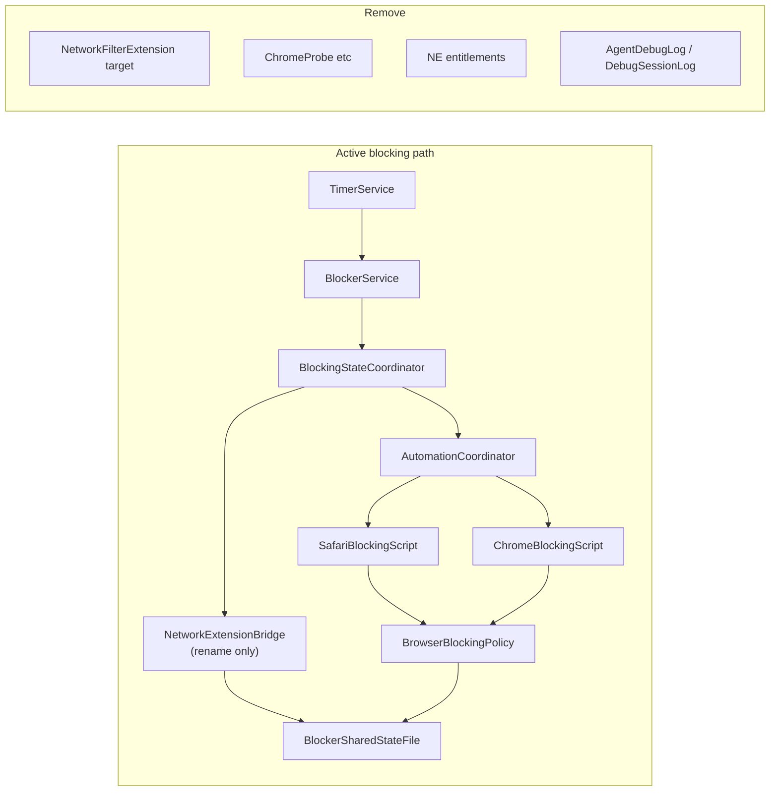

# Network Extension Removal

**Status:** Planning (revised)  
**Last updated:** 2026-05-26  
**Goal:** macOS App Store readiness — remove unused Network Extension surface area, dead code, and debug instrumentation left over from the filter-extension era.

---

## Intention

FocusHacker **no longer uses** the Network Extension framework for blocking. Runtime blocking today is:

- **Browser blocking:** AppleScript automation (Safari + Chrome tab redirection) via [`AutomationCoordinator`](FocusHacker/Automation/AutomationCoordinator.swift)
- **App blocking:** Native process termination via [`AppProcessMonitor`](FocusHacker/AppBlocking/AppProcessMonitor.swift)
- **Shared state:** App Group UserDefaults + `/Users/Shared` JSON ([`BlockerSharedStateFile`](Shared/BlockerSharedStateFile.swift)), read by [`BrowserBlockingPolicy`](Shared/BrowserBlockingPolicy.swift)

We intend to:

1. **Remove** Network Extension entitlements, the stale `NetworkFilterExtension` Xcode target (folder already gone), and all `Shared/` code that only existed for `NEFilter*` / socket-flow filtering.
2. **Remove** session debug instrumentation (`AgentDebugLog`, `DebugSessionLog*`, `#region agent log` blocks) added while diagnosing the extension.
3. **Rename** [`NetworkExtensionBridge`](FocusHacker/Services/Blocker/NetworkExtensionBridge.swift) → `BlockingStateManager` — it never imported `NetworkExtension`; it only manages lease + JSON projection.
4. **Simplify** blocker APIs (`bounceFilterConnectionsOnActivate`, `tearDownStaleConnectionsOnActivate`, `refreshBlockedIPLiteralsAfterBlocklistChange`) that are already no-ops in the bridge.
5. **Update** docs (`requirements.md`, `CONTRIBUTING.md`) so they describe AppleScript blocking, not Content Filter Provider.

We are **not** removing the shared-state / lease layer — that is still required for browser automation and app blocking to know when focus blocking is active.

---

## Risk assessment: will this break anything?

### Low risk (safe to remove)

| Item | Why it is safe |
|------|----------------|
| `NetworkFilterExtension/` target + sources | **Folder already missing** from the repo; `project.yml` still references it (CI runs `xcodegen` — latent breakage). Removing target config fixes that without changing runtime behavior. |
| `ChromeProbe*`, `ChromeStaleRestFlowRegistry`, `TLSServerNameSniffer`, `BlockedDomainIPProbes` | **Zero call sites** from the host app; only compiled into the main target as dead code. |
| `AgentDebugLog`, all `DebugSessionLog*` files, `#region agent log` | Diagnostic only; no product behavior. |
| `openNetworkExtensionsSettings()` | Never called. |
| `bounceFilter*` / `tearDownStale*` parameters | Already ignored in [`NetworkExtensionBridge`](FocusHacker/Services/Blocker/NetworkExtensionBridge.swift) (`_ = bounceFilterConnectionsOnActivate`). |
| `refreshBlockedIPLiteralsAfterBlocklistChange()` | Empty implementation in the bridge; browser blocking uses **domains**, not IP literals. |

### Medium risk (careful, but manageable)

| Item | Risk | Mitigation |
|------|------|------------|
| **NE entitlement removal without new provisioning profile** | **Release archive signing fails days later** — not caught by `CODE_SIGNING_ALLOWED=NO` CI | **Blocking Phase 1 step:** regenerate App Store profile; verify Xcode uses it (see Phase 1). |
| Rename `NetworkExtensionBridge` → `BlockingStateManager` | Missed reference → compile error | IDE rename + pre-flight / completion `rg` (10 references in 4 files as of 2026-05-26). |
| **Payload trim** (`blockedIPLiterals`, `aggressiveUdp443DropWhileBlocking`) | Old on-disk JSON may still contain fields | **Decision (fixed):** keep optional `Codable` properties; stop all merge/write paths; document in code comments. Update [`PersistenceTests`](FocusHackerTests/PersistenceTests.swift). |
| Trim [`BlockerSharedConstants`](Shared/BlockerSharedConstants.swift) | Accidentally remove lease TTL / App Group keys | Grep for each key before delete; run persistence + smoke tests. |
| Simplify `TimerService` resume/focus activation | Behavior change if params removed incorrectly | Keep `setBlockingActive(true/false)` + epoch; re-run timer smoke tests after Phase 5. |

### What must **not** be removed

| Item | Still used by |
|------|----------------|
| [`BlockerSharedStateFile`](Shared/BlockerSharedStateFile.swift) | `BrowserBlockingPolicy`, `AppBlockingPolicy`, settings sync, tests |
| [`BlockingSnapshotWriter`](Shared/BlockingSnapshotWriter.swift) | Bridge (→ `BlockingStateManager`) |
| [`BlockerAppGroup`](Shared/BlockerSharedConstants.swift) (lease keys, suite ID) | Bridge, `UserDefaultsSettingsStore`, `AppProcessMonitor` |
| [`BlocklistEvaluation`](Shared/BlocklistEvaluation.swift) | Blocklist UI, browser/app policies, tests |
| [`AutomationCoordinator`](FocusHacker/Automation/AutomationCoordinator.swift) | `BlockingStateCoordinator` on every focus start/stop |

### Overall verdict

**Removing Network Extension code should not break blocking** if we preserve the shared-state + lease path and AppleScript coordinator. The main regression vectors are: (1) accidental deletion of shared JSON/lease logic, (2) timer tests that assert obsolete bounce/sysext behavior, (3) **provisioning profile mismatch after entitlement change** (must be explicit in Phase 1). All are detectable with build + unit tests + provisioning verification + a short manual focus-session QA pass.

---

## `BlockerSharedStateFile.Payload` — definitive trim decision

**Do not leave this as “optional” in implementation.**

We **will trim** extension-only fields from active code paths:

| Field | Action |
|-------|--------|
| `blockedIPLiterals` | Keep on `Payload` as **optional** `Codable` for backward-compatible decode of old `/Users/Shared` JSON. **Stop writing and merging** IP literals in host merge/snapshot paths. Remove App Group suite key usage for IP refresh. |
| `aggressiveUdp443DropWhileBlocking` | Same: **optional decode only**, no new writes. |

Add a brief comment on `Payload` and on merge helpers, e.g. *“Retained for decoding legacy extension-era JSON; host no longer populates these fields.”*

Update tests that asserted IP literal preservation to reflect stop-write behavior (decode of existing files may still pass).

---

## Pre-flight check (run once before Phase 1)

Validates assumptions. Re-run if the branch is stale.

```bash
# Verify NE is unused in the host app target
rg 'import NetworkExtension|NEFilter' FocusHacker/ --glob '*.swift'
# Expect: no `import NetworkExtension`; at most comment/doc references (e.g. NEFilterManager in ServiceProtocols)

# NE references in Shared/ should only be in files slated for deletion (Phase 2)
rg 'import NetworkExtension|NEFilter' Shared/ --glob '*.swift' -l

# Rename footprint
rg 'NetworkExtensionBridge' --glob '*.swift'
# Expect: ~10 references in 4 files (bridge, coordinator, protocols, one comment in BlockerSharedStateFile)

# Debug instrumentation footprint
rg 'AgentDebugLog|DebugSessionLog' --glob '*.swift' | wc -l
```

**Snapshot (2026-05-26 on main working tree):**

| Check | Result |
|-------|--------|
| `FocusHacker/` `import NetworkExtension` / `NEFilter` | **0 imports**; 1 comment (`NEFilterManager` in `ServiceProtocols.swift`) |
| `Shared/` NE imports | **4 files** — all in Phase 2 delete list |
| `NetworkExtensionBridge` references | **10 matches**, **4 files** |
| Debug log calls | **~63** `.write(` call sites (see scope section) |

---

## Current architecture (what is actually live)



---

## Scope overview

### Rough line counts

| Category | Files | Approx. lines |
|----------|-------|----------------|
| **Delete entirely** | 16 Swift files | **~1,200** |
| **Strip debug instrumentation** (files we keep) | 10 production Swift files | **~600** (`#region agent log`) + **~57** log `.write(` calls |
| **Trim / simplify** (constants, shared state, blocker API) | ~8 files | **~100–150** net removed |
| **Rename only** (`NetworkExtensionBridge` → `BlockingStateManager`) | 1 file + references | ~105 lines kept |
| **Tests** | 4–5 files | **~50–80** changed/removed |
| **Config & docs** | 5–6 files | ~50 |

**Estimated net reduction: ~1,900–2,100 lines** (mostly deletions).

### Suggested commit strategy

| Commit | Phases | Rationale |
|--------|--------|-----------|
| 1 | Pre-flight + Phase 1 | Project/entitlements + **provisioning** |
| 2 | Phase 2 | Delete dead NE `Shared/` files |
| 3 | Phase 3 | Rename bridge only |
| 4 | **Phase 4** | Debug removal only — large diff, **zero behavior change**; easy review |
| 5 | Phase 5 + 6 | API/test simplification + docs + QA |

---

## Execution phases (revised order)

Debug instrumentation (**Phase 4**) runs **before** blocker API simplification (**Phase 5**) so review stays simpler: delete-only debug work lands first; higher-touch API/test changes follow.

### Phase 1 — Project, entitlements & provisioning (blocking)

**Do not skip provisioning.** CI uses `CODE_SIGNING_ALLOWED=NO` and will not catch profile drift.

1. Run [Pre-flight check](#pre-flight-check-run-once-before-phase-1).
2. Update `project.yml`: remove `NetworkFilterExtension` target, embed dependency, and `NetworkFilterExtensionTests`.
3. Run `xcodegen generate`.
4. Remove NE keys from `FocusHacker/FocusHacker.entitlements` (see [Entitlements reference](#entitlements-reference)).
5. **Provisioning (mandatory, front-loaded):**
   - In [Apple Developer](https://developer.apple.com/account/resources/profiles/list): edit or recreate the **Mac App Store** (or distribution) profile for `com.focushacker.app` so it matches entitlements **without** Network Extension / system extension install.
   - In Xcode: **Settings → Accounts → Download Manual Profiles** (or let automatic signing refresh).
   - Open the FocusHacker target → **Signing & Capabilities**: confirm the active profile lists only App Groups + Apple Events (no Network Extension).
   - **Mandatory for whoever lands Phase 1:** **Product → Archive** locally (or `xcodebuild archive` with distribution signing) once before merging. CI uses `CODE_SIGNING_ALLOWED=NO` and will not catch profile/capability drift; archive validates signing the same day entitlements change.
6. `xcodebuild build` + `xcodebuild test` with `CODE_SIGNING_ALLOWED=NO`.

**Phase 1 complete when:**

- [ ] Pre-flight recorded (or re-run clean)
- [ ] `project.yml` / generated `.xcodeproj` have no `NetworkFilterExtension` target
- [ ] NE entitlements removed from `FocusHacker.entitlements`
- [ ] **App Store provisioning profile regenerated after entitlement deletion**
- [ ] **Xcode verified to use the updated profile** (Signing & Capabilities)
- [ ] **Local archive succeeded** with updated profile (first engineer landing Phase 1)
- [ ] Build + unit tests pass in CI locally

### Phase 2 — Delete dead `Shared/` NE code

1. Delete the six Chrome probe / filter files (see [Files to delete](#files-to-delete-16-swift-1200-lines)).
2. Remove dangling `ChromeProbeControlRulesWatcher.swift` project reference if present.
3. Trim `BlockerSharedConstants` (extension-only keys, ping/counter helpers, `filterDataProviderBundleIdentifier`, etc.).
4. Apply [**Payload trim decision**](#blockersharedstatefilepayload--definitive-trim-decision) in `BlockerSharedStateFile.swift` (stop write/merge; keep optional `Codable` fields + comments).
5. Adjust `PersistenceTests` for stop-write IP literal behavior.

### Phase 3 — Rename bridge

1. `NetworkExtensionBridge.swift` → `BlockingStateManager.swift`
2. `NetworkExtensionBridge` → `BlockingStateManager`; `NetworkExtensionBridgeProtocol` → `BlockingStateManagerProtocol`
3. Update `BlockingStateCoordinator`, `ServiceProtocols`, comments in `BlockerSharedStateFile`
4. `rg 'NetworkExtensionBridge'` → zero hits

### Phase 4 — Remove debug instrumentation (before API changes)

Pure deletion — no API or runtime behavior changes. Safe to land as its own PR/commit.

1. Delete all `DebugSessionLog*` / `AgentDebugLog` / `DebugModeLog29f2d5` files (see delete list).
2. Strip all `#region agent log` / `#endregion` blocks from production Swift (10 files; largest: `AppShellViewModel`, `TimerService`).
3. Remove `runFE1347AutoVerifySession` and `FE1347_AUTO_VERIFY` hook from `FocusHackerAppDelegate`.
4. Delete local `.cursor/debug-*.log` files.
5. **Mandatory `.gitignore` update:**

   ```bash
   # Append if not already present
   grep -qF '.cursor/debug-*.log' .gitignore || echo '.cursor/debug-*.log' >> .gitignore
   ```

**Phase 4 complete when:**

- [ ] No `AgentDebugLog` / `DebugSessionLog` Swift files remain
- [ ] No `#region agent log` in `FocusHacker/` or `Shared/`
- [ ] `.gitignore` contains `.cursor/debug-*.log`
- [ ] Build + tests still pass

### Phase 5 — Simplify blocker API & tests

1. Remove `bounceFilterConnectionsOnActivate`, `tearDownStaleConnectionsOnActivate`, `refreshBlockedIPLiteralsAfterBlocklistChange` from protocols and implementations.
2. Simplify `TimerService` (fe1347 comments, tearDown/bounce call sites, resume bounce).
3. Remove `openNetworkExtensionsSettings()` from `SystemSettingsLinker`.
4. Remove `refreshBlockedIPLiteralsAfterBlocklistChange()` call from `BlockerSettingsController`.
5. Update / delete tests: `FocusHackerSmokeTests` (bounce/sysext), spies in `AppShellStateTests` / onboarding tests, delete `BlockerPauseResumeDiagnosticsTests` if obsolete.

### Phase 6 — Documentation & verification

1. Update `requirements.md`, `CONTRIBUTING.md`, `schema.md` (drop NE from tech stack if listed).
2. Grep verification:

   ```bash
   rg 'import NetworkExtension|NEFilter|NetworkExtensionBridge|AgentDebugLog|DebugSessionLog|ChromeProbe|ChromeStale' --glob '*.swift'
   rg 'com.apple.developer.networking.networkextension|system-extension.install' .
   ```

3. **Manual QA:** focus start/stop, pause/resume, blocklist edit, Safari + Chrome redirect, blocked app quit, onboarding automation primer.

---

## Files to delete (16 Swift, ~1,200 lines)

**Network Extension–only `Shared/` (~681 lines):**

- `Shared/ChromeProbeControlRulesCoordinator.swift` (141)
- `Shared/ChromeProbeControlRuleState.swift` (112)
- `Shared/ChromeProbeControlRulesFile.swift` (83)
- `Shared/ChromeStaleRestFlowRegistry.swift` (256)
- `Shared/TLSServerNameSniffer.swift` (66)
- `Shared/BlockedDomainIPProbes.swift` (23)

**Debug log types (~520 lines):**

- `Shared/AgentDebugLog.swift`
- `Shared/DebugSessionLog.swift`
- `Shared/DebugModeLog29f2d5.swift`
- `Shared/DebugSessionLog3c541f.swift`
- `Shared/DebugSessionLog594ccb.swift`
- `Shared/DebugSessionLog5cee87.swift`
- `Shared/DebugSessionLog81bf96.swift`
- `Shared/DebugSessionLog82afba.swift`
- `Shared/DebugSessionLogAc92a4.swift`
- `Shared/DebugSessionLogAfdf58.swift`

### Files to edit (by phase)

| Phase | Files |
|-------|--------|
| 2 | `Shared/BlockerSharedConstants.swift`, `Shared/BlockerSharedStateFile.swift`, `FocusHackerTests/PersistenceTests.swift` |
| 3 | `NetworkExtensionBridge.swift` → `BlockingStateManager.swift`, `BlockingStateCoordinator.swift`, `ServiceProtocols.swift` |
| 4 | `AppShellViewModel`, `TimerService`, `GamificationDashboardReader`, `FocusHackerAppDelegate`, `MainWindowPresenter`, `AppDependencies`, `SessionRecording`, `AnalyticsDetailViewModel`, `ProfileDashboardView`, `ProfileFocusChartView`, `.gitignore` |
| 5 | `BlockerService`, `TimerService`, `SystemSettingsLinker`, `BlockerSettingsController`, test files listed above |
| 6 | `requirements.md`, `CONTRIBUTING.md`, `schema.md` |

### Files we will not touch

- `FocusHacker/Automation/*`
- `Shared/BrowserBlockingPolicy.swift`, `Shared/BlocklistEvaluation.swift`, `Shared/BlockingSnapshotWriter.swift`
- `FocusHacker/AppBlocking/*`

---

## Entitlements reference

**Remove from `FocusHacker/FocusHacker.entitlements`:**

```xml
<key>com.apple.developer.networking.networkextension</key>
<array>
    <string>content-filter-provider</string>
</array>

<key>com.apple.developer.system-extension.install</key>
<true/>
```

**Keep:**

```xml
<key>com.apple.security.application-groups</key>
<array>
    <string>group.com.focushacker.blocker</string>
</array>

<key>com.apple.security.automation.apple-events</key>
<true/>
```

---

## Rollback

If blocking regresses after merge:

1. `git revert` the removal commit(s).
2. `xcodegen generate` if `project.yml` changed.
3. Restore matching provisioning profile if entitlements were reverted.
4. Re-test focus session blocking before shipping.

---

## Completion checklist

- [ ] Pre-flight checks passed (documented)
- [ ] Zero `import NetworkExtension` / `NEFilter` in remaining Swift sources
- [ ] Zero `NetworkExtensionBridge` references (renamed)
- [ ] NE entitlements removed; App Group + Apple Events retained
- [ ] **`NetworkExtension` / system-extension capabilities removed from App Store provisioning profile**
- [ ] **Xcode signing uses updated profile** (Signing & Capabilities)
- [ ] **Local archive succeeded** after entitlement change (not optional for Phase 1 author)
- [ ] `project.yml` has no `NetworkFilterExtension` target
- [ ] Payload: IP / UDP fields decode-only; no host writes (comments in code)
- [ ] CI build + unit tests pass
- [ ] No `AgentDebugLog` / `DebugSessionLog` in repo; `.gitignore` has `.cursor/debug-*.log`
- [ ] Manual blocking QA passed
- [ ] `requirements.md` describes AppleScript blocking

---

**Document version:** 2.1 (revised plan: provisioning blocking, payload decision, phase reorder, mandatory `.gitignore`, pre-flight)
